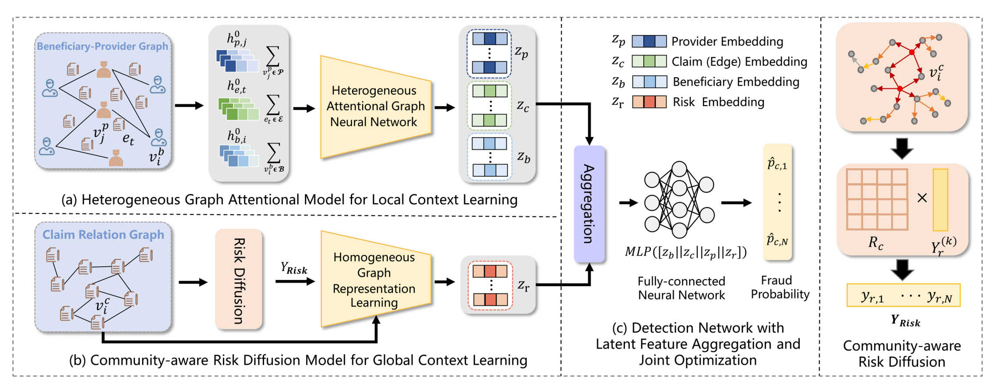

# Fighting against Organized Fraudsters Using Risk Diffusion-based Parallel Graph Neural Network



## 1. Code

Coming soon.

## 2. Medical Fraud Dataset

### 2.1 PURPOSE

We found that the data about medical fraud is rare and it is difficult to search accurate and reliable information for it, so we collected some medical fraud data and give fraud labels and gang fraud labels according to experts in relevant fields to help follow-up researchers to study this field and relieve the lack of data.

### 2.2 FORMAT DESCRIPTION

In the dataset, the format of the date is : year/month/day hour:minute:second. We convert the null values in original data to -1.

### 2.3 STATISTICAL INFORMATION

* about 550 thousands claims
* data from 2009
* about 5000 providers,500 fraud providers,100 group fraud providers
* 138 thousands beneficiaries

### 2.4 DATA SOURCE
The origin source of the data comes from the website and you can find more information about it on :https://www.kaggle.com/datasets/rohitrox/healthcare-provider-fraud-detection-analysis

### 2.5 THE FORMAT AND THE MEANINGS

#### claim.csv

| attribute              | meaning                                           |
| ---------------------- | ------------------------------------------------- |
| ClaimID                |                                                   |
| BeneID                 |                                                   |
| ClaimStartDt           | Date of claim start                               |
| ClaimEndDt             | Date of claim end                                 |
| InscClaimAmtReimbursed | Claim amount                                      |
| AdmissionDt            | Date of admission                                 |
| ClmAdmitDiagnosisCode  | Claim diagnostic code                             |
| DeductibleAmtPaid      | Patient self payment                              |
| DischargeDt            | Date the patient was discharged                   |
| DiagnosisGroupCode     | Diagnostic classification group code for patients |
| inpatent               | Whether this claim is inpatient                   |
| PotentialFraud         | Fraud label                                       |
| PotentialGroupFraud    | Group Fraud label                                 |

#### bene.csv

| attribute                       | meaning                                  |
| ------------------------------- | ---------------------------------------- |
| BeneID                          |                                          |
| DOB                             | Date of birth                            |
| DOD                             | Date of death                            |
| Gender                          |                                          |
| Race                            |                                          |
| RenalDiseaseIndicator           | the patient have renal failure problems  |
| State                           |                                          |
| County                          |                                          |
| NoOfMonths_PartACov             |                                          |
| NoOfMonths_PartBCov             |                                          |
| ChronicCond_Alzheimer           | Have Alzheimer disease (2 no, 1 yes)     |
| ChronicCond_Heartfailure        | Have Heartfailure (2 no, 1 yes)          |
| ChronicCond_KidneyDisease       | Have KidneyDisease (2 no, 1 yes)         |
| ChronicCond_Cancer              | Have Cancer (2 no, 1 yes)                |
| ChronicCond_ObstrPulmonary      | Have ObstrPulmonary (2 no, 1 yes)        |
| ChronicCond_Depression          | Have Depression (2 no, 1 yes)            |
| ChronicCond_Diabetes            | Have Diabetes (2 no, 1 yes)              |
| ChronicCond_IschemicHeart       | Have IschemicHeart (2 no, 1 yes)         |
| ChronicCond_Osteoporasis        | Have Osteoporasis (2 no, 1 yes)          |
| ChronicCond_rheumatoidarthritis | Have rheumatoidarthritis (2 no, 1 yes)   |
| ChronicCond_stroke              | Have stroke (2 no, 1 yes)                |
| IPAnnualReimbursementAmt        | Maximum reimbursement amount for hospitalization |
| IPAnnualDeductibleAmt           | patient's annual hospital deductible     |
| OPAnnualReimbursementAmt        | Maximum reimbursement amount for outpatient visits |
| OPAnnualDeductibleAmt           | The patient's annual out of pocket expenses for outpatient visits |
|                                 |                                          |

## 3. Citing
If you find RDPGL is useful for your research, please consider citing the following papers:

```
@inproceedings{mafighting,
    title={Fighting against Organized Fraudsters Using Risk Diffusion-based Parallel Graph Neural Network},
    author={Ma, Jiacheng and Li, Fan and Zhang, Rui and Xu, Zhikang and Cheng, Dawei and Ouyang, Yi and Zhao, Ruihui and Zheng, Jianguang and Zheng, Yefeng and Jiang, Changjun},
    booktitle={International Joint Conference on Artificial Intelligence},
    year = {2023},
    month = {08},
    pages = {6138-6146},
    doi = {10.24963/ijcai.2023/681}
}
```
